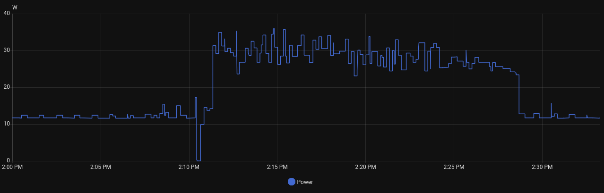

# micro-cluster
Experiments with distributed algorithms and data structures on a cluster of small single board computers using OpenMPI.

*Nothing here is meant to serve as a how‑to guide.*

# Table of Contents
- [micro-cluster](#micro-cluster)
- [Table of Contents](#table-of-contents)
- [Hardware](#hardware)
  - [🖥️ Cluster Overview](#️-cluster-overview)
  - [⚙️ Individual Node Specifications](#️-individual-node-specifications)
  - [🧩 Networking](#-networking)
  - [⚡ Power \& Cooling](#-power--cooling)
- [Real-time Monitoring with Prometheus \& Grafana](#real-time-monitoring-with-prometheus--grafana)
  - [What We're Watching and Why](#what-were-watching-and-why)
  - [Prometheus](#prometheus)
  - [Grafana](#grafana)
  - [Configuring Alerts](#configuring-alerts)
- [Software](#software)
  - [SLURM](#slurm)
    - [munge](#munge)
    - [Setup SLURM](#setup-slurm)
  - [OpenMPI](#openmpi)
- [Performance](#performance)
  - [A Note on Hardware Limitations](#a-note-on-hardware-limitations)
- [Power Consumption](#power-consumption)
  - [Graph of Power Usage](#graph-of-power-usage)
  - [Analysis](#analysis)
- [Using Ansible to Preserve Sanity](#using-ansible-to-preserve-sanity)
- [References](#references)

# Hardware

## 🖥️ Cluster Overview
| Component              | Description                                    |
| ---------------------- | ---------------------------------------------- |
| **Total Nodes**        | `7`                                            |
| **Architecture**       | `aarch64`                                      |
| **Operating System**   | [**Armbian 25.8.1**](https://www.armbian.com/) |
| **MPI Implementation** | `OpenMPI v5.0.8`                               |
| **Network Topology**   | `Ethernet`                                     |
| **Filesystem Sharing** | `NFS`                                          |

## ⚙️ Individual Node Specifications
| Component       | Specification                                                                        |
| --------------- | ------------------------------------------------------------------------------------ |
| **Board Model** | [**Sweet Potato AML-S905X-CC-V2**](https://libre.computer/products/aml-s905x-cc-v2/) |
| **CPU**         | `4 × ARM Cortex-A53 @ 1.416 GHz`                                                     |
| **RAM**         | `2 GB 32-bit DDR4 SDRAM`                                                             |
| **Storage**     | `16 GB eMMC`                                                                         |
| **Networking**  | `100 Mb Ethernet`                                                                    |
| **Cooling**     | `Passive heatsinks`                                                                  |
| **Power**       | `5 W full load / < 1 W idle`                                                         |

## 🧩 Networking
| Component     | Description                                                                                                       |
| ------------- | ----------------------------------------------------------------------------------------------------------------- |
| **Switch**    | [**TP-Link 8 Port Gigabit Switch**](https://www.amazon.com/TP-Link-Gigabit-Ethernet-Network-Switch/dp/B00A121WN6) |
| **Topology**  | `Star`                                                                                                            |
| **IP Scheme** | `192.168.5.50–56`                                                                                                 |

## ⚡ Power & Cooling
| Component                   | Description             |
| --------------------------- | ----------------------- |
| **Power Supply**            | `10-port USB hub`       |
| **Cooling**                 | `Single 120 mm USB fan` |
| **Total Power Consumption** | `~30 W under load`      |

# Real-time Monitoring with Prometheus & Grafana
With [Prometheus](https://prometheus.io/) and [Grafana](https://grafana.com/), we can easily create a visual dashboard that can be used to quickly detect performance issues and optionally get notified when a node goes down or a job stalls.

## What We're Watching and Why
- **CPU Frequency** – Monitors for thermal throttling; a sudden drop usually indicates overheating.
- **CPU Temperature** – Another indicator of thermal throttling.
- **Load Averages (1 / 5 / 15 min)** – Quick sanity check of how many processes are competing for CPU.
- **Memory Usage** – Proportion of RAM in use; a sudden spike often precedes swapping.
- **Swap Space** – Any activity is an immediate sign of a memory bottleneck.
- **Power Usage** – Sudden fluctuations are a likely indicator of node failure.
<figure>
  
  <figcaption>Figure 1: Grafana dashboard showing current and historical information for the SBC cluster.
  <br><i>Note: CPU Frequency appears linear because the CPU governor on each node has been explicitly  set to 'performance'. </i><br> </figcaption>
</figure>
<br>

## Prometheus
**Prometheus** is an open‑source monitoring system that collects metrics via HTTP pulls, stores them in a time‑series database, and provides a powerful query language (PromQL) for real‑time analysis.  

I found it more straight-forward to create a custom Prometheus exporter instead of trying to adapt an existing one. Running `python3 ./web-server.py` makes the node metrics available via HTTP. When an HTTP request hits the python web server at port `2146`, it executes `cluster-stats.bash`, then serves the resulting output.

After installing Prometheus, add a new scape configuration to `prometheus.yml`.

```
# prometheus.yml
scrape_configs:
  - job_name: cluster_scrape # New job
    static_configs:
      - targets: ['localhost:2146']
```

## Grafana
**Grafana** is an open-source visualization platform that consumes data from Prometheus (as well as other sources), making it simple to build interactive dashboards, set alerts, and monitor the collected metrics at a glance.

After installing Grafana, import `grafana-dashboard.json`.

## Configuring Alerts
Grafana’s built‑in alerting gives you instant notifications for undesirable conditions, such as dips in CPU frequency, swap usage, node failures, etc.

I opted for a self‑hosted [ntfy](https://docs.ntfy.sh/install/) instance to serve as the central hub for Grafana notifications, which even offers a dedicated [Android app](https://play.google.com/store/apps/details?id=io.heckel.ntfy) for alerts on the go.

Setting up a Webhook channel

1. Grafana → Alerting → Notification channels → Add channel  
2. Choose Webhook as the channel type.  
3. Paste the webhook URL provided by your ntfy instance (e.g., https://ntfy.example.com/your‑topic).  
4. Give the channel a name and click Save.

You can now attach this channel to any alert rule in Grafana. Test the configuration by sending a test notification from ntfy or by triggering a rule in Grafana’s Alerting UI.

# Software

## SLURM
[**SLURM**](https://slurm.schedmd.com/overview.html) (Simple Linux Utility for Resource Management) is a popular open‑source workload manager that schedules jobs, allocates resources, and monitors execution on a cluster.
  
On a small SBC cluster it may feel like overkill, but it gives you a familiar CLI, job‑dependency handling, as well as automatic node‑level isolation and failure recovery.

### munge
SLURM relies on **munge** (MUNGE Authentication Daemon) to authenticate every intra‑cluster communication.  
When a job is submitted or a node reports its status, SLURM daemons (`slurmctld`, `slurmd`, `srun`, …) exchange a short “ticket” containing the user’s UID and a timestamp.  Munge signs this ticket with a shared secret key that is known only to the nodes in the cluster; the recipient verifies the signature before accepting the request.
  
Install munge and its libraries:

```
sudo apt isntall munge libmunge2 libmunge-dev -y
```

Pick a node to serve as the control node, then copy `/etc/munge/munge.key` from that node to all of the other nodes with `rsync` or `scp`.
> Be sure the file is owned by munge:munge and has mode 600!

Finally, start munge:
```
sudo systemctl enable --now munge.service
```

### Setup SLURM

```
sudo apt install slurm-wlm -y
```


Copy the config file to `/etc/slurm/slurm.conf` on every machine.
> You can easily generate the config using the following tool provided by the SLURM developers: 
> * https://slurm.schedmd.com/configurator.html
  

Start and enable SLURM:
```
# On the control node
sudo systemctl enable --now slurmctld.service

# On every worker node
sudo systemctl enable --now slurmd.service
```

With both daemons running, you can submit MPI jobs via sbatch, monitor queues with squeue, and let SLURM handle scheduling and fault tolerance automatically.

## OpenMPI

If you're going to use SLURM, you should consider building the most recent version of OpenMPI from source and building with `--with-slurm` and `--with-pmix`.

```
# Download OpenMPI
wget https://download.open-mpi.org/release/open-mpi/v5.0/openmpi-5.0.8.tar.gz

# Extract
tar -xzf openmpi-5.0.8.tar.gx
cd openmpi-5.0.8

# Configure
./configure --prefix=/opt/openmpi --with-slurm --with-pmix

# Make and install
make -j$(nproc)
make install
```

Without slurm, the default package provided in the Armbian repos is good enough. Install it with:
```
sudo apt instal libopenmpi-dev
```

# Performance
For more on performance, see the [`hpl`](https://github.com/robpellegrin/micro-cluster/tree/main/hpl) directory.

## A Note on Hardware Limitations
Each node connects to a Gigabit Ethernet switch through the board’s 100 Mbps Ethernet port, which quickly becomes the bottleneck for workloads that involve frequent or heavy inter‑node traffic, such as the HPL benchmark. For moderate‑to‑high inter‑node traffic, network latency and bandwidth limits will significantly degrade performance.

This constraint can be easily identified with tools available in the default package repositories, notably `iperf3`, which measures bandwidth between nodes, and `iftop`, which monitors traffic on a specific interface.

# Power Consumption
Power consumption is an important consideration for any cluster—every watt drawn translates directly into electricity bills, especially when the cluster runs for an extended period of time. A nice benefit of SBCs are their low power consumption, keeping operating costs down.

For real‑time power monitoring I used a [THIRDREALITY Zigbee Smart Plug](https://www.amazon.com/THIRDREALITY-Monitoring-Certified-Compatible-SmartThing/dp/B0BPY2KRHH) and [Home Assistant](https://www.home-assistant.io/). The plug reports instantaneous voltage and current to Home Assistant, which exposes the measurements through its [REST API](https://developers.home-assistant.io/docs/api/rest/). Poll that endpoint, parse the JSON payload, and ingest the data into our monitoring stack (Grafana/Prometheus) for continuous graphing and alerting.

## Graph of Power Usage
<figure>
  
  <figcaption>Figure 2: Power consumption over 30 minutes. The cluster is idle for 10 minutes, briefly powered off, then put under a heavy load with the HPL benchmark before returning to idle.
  <br>
  </figcaption>
</figure>
<br>

## Analysis

The data from Home Assistant can be easily exported into a CSV for numerical analysis.  
From this data, we get the following:

| State      | Max     | Min     | Mean    |
| ---------- | ------- | ------- | ------- |
| Idle       | `16.1w` | `11.6w` | `12.6w` |
| Under Load | `34.5w` | `26.8w` | `30.1w` |

These measurements show that the entire cluster draws only ≈ 30 watts under full load—roughly the power of a single laptop—demonstrating that a low‑power SBC cluster is an exceptionally cost‑effective platform for experimenting with distributed systems.

# Using Ansible to Preserve Sanity

[Ansible](https://docs.ansible.com/ansible/latest/index.html) is a critical component of cluster operations. Without it we would be manually SSH‑ing into each node (one at a time), installing packages, compiling OpenBLAS, deploying HPL, etc. Ansible allows us to define the desired state of every node in a single, idempotent playbook and execute those changes on all hosts simultaneously. This guarantees identical configuration across the cluster and, most importantly, eliminates monotonous SSH sessions.

The playbooks/roles used to manage this cluster are in a dedicated ansible repository:
- https://github.com/robpellegrin/ansible

# References
| Site                    | URL                                                 |
| ----------------------- | --------------------------------------------------- |
| Armbian                 | https://www.armbian.com/                            |
| Ansible Docs            | https://docs.ansible.com/                           |
| Grafana                 | https://grafana.com/                                |
| Prometheus              | https://prometheus.io/                              |
| OpenMPI                 | https://www.open-mpi.org/                           |
| Home Assistant REST API | https://developers.home-assistant.io/docs/api/rest/ |
| GNU Parallel            | https://www.gnu.org/software/parallel/              |
| ntfy                    | https://docs.ntfy.sh/install/                       |

---
