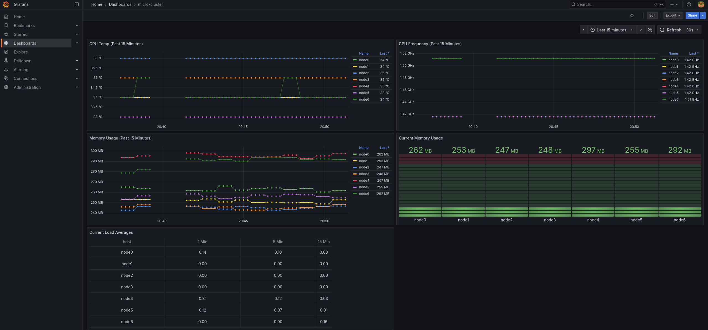

# micro-cluster
Experiments with distributed algorithms and data structures on a cluster of small single board computers using OpenMPI.

*Nothing here is meant to be a how‑to guide*

## Table of Contents
- [micro-cluster](#micro-cluster)
  - [Table of Contents](#table-of-contents)
  - [1. Hardware](#1-hardware)
    - [🖥️ Cluster Overview](#️-cluster-overview)
    - [⚙️ Individual Node Specifications](#️-individual-node-specifications)
    - [🧩 Networking](#-networking)
    - [⚡ Power \& Cooling](#-power--cooling)
  - [2. Note On SBC Limitations](#2-note-on-sbc-limitations)
  - [3.  Real-time Monitoring with Prometheus \& Grafana](#3--real-time-monitoring-with-prometheus--grafana)
    - [What we're watching](#what-were-watching)
  - [4. Ansible](#4-ansible)


## 1. Hardware

<table>
  <tr>
    <td width="50%" valign="top">

### 🖥️ Cluster Overview

| Component              | Description                                    |
| ---------------------- | ---------------------------------------------- |
| **Total Nodes**        | `7`                                            |
| **Architecture**       | `aarch64`                                      |
| **Operating System**   | [**Armbian 25.8.1**](https://www.armbian.com/) |
| **MPI Implementation** | `OpenMPI v4.1.4`                               |
| **Network Topology**   | `Ethernet`                                     |
| **Filesystem Sharing** | `NFS`                                          |

</td>
<td width="50%" valign="top">

### ⚙️ Individual Node Specifications

| Component       | Specification                                                                        |
| --------------- | ------------------------------------------------------------------------------------ |
| **Board Model** | [**Sweet Potato AML-S905X-CC-V2**](https://libre.computer/products/aml-s905x-cc-v2/) |
| **CPU**         | `4 × ARM Cortex-A53 @ 1.416 GHz`                                                     |
| **RAM**         | `2 GB 32-bit DDR4 SDRAM`                                                             |
| **Storage**     | `16 GB eMMC`                                                                         |
| **Networking**  | `100 Mb Ethernet`                                                                    |
| **Cooling**     | `Passive heatsinks`                                                                  |
| **Power**       | `5 W full load / < 1 W idle`                                                         |

</td>
  </tr>
</table>

<table>
  <tr>
    <td width="50%" valign="top">

### 🧩 Networking

| Component     | Description                                                                                               |
| ------------- | --------------------------------------------------------------------------------------------------------- |
| **Switch**    | [**8-Port Gigabit Switch**](https://www.amazon.com/TP-Link-Gigabit-Ethernet-Network-Switch/dp/B00A121WN6) |
| **Topology**  | `Star`                                                                                                    |
| **IP Scheme** | `192.168.5.50–56`                                                                                         |

</td>
<td width="50%" valign="top">

### ⚡ Power & Cooling

| Component                   | Description             |
| --------------------------- | ----------------------- |
| **Power Supply**            | `10-port USB hub`       |
| **Cooling**                 | `Single 120 mm USB fan` |
| **Total Power Consumption** | `~50 W under load`      |

</td>
  </tr>
</table>

## 2. Note On SBC Limitations
> The nodes are connected to a gigabit switch via 100 Mb Ethernet, which quickly becomes a bottleneck for applications that involve frequent or heavy communication between nodes (like the HPL benchmark). For workloads with moderate to high inter-node messaging, network latency and bandwidth limitations will significantly impact performance.

## 3.  Real-time Monitoring with Prometheus & Grafana
With Prometheus and Grafana, we can easily create a visual dashboard that can be used to quickly detect performance issues and optionally get notified when a node goes down or a job stalls.

### What we're watching

- CPU Frequency: keeps an eye on thermal throttling; a sudden drop usually means the node is overheating.
- CPU Temperature: another metric to watch for thermal throttling.
- Load Averages (1 / 5 / 15 min): a quick sanity check on how many processes are competing for CPU.
- Memory Usage: used out of total; a spike often precedes swapping.
- Swap Space: TODO

<figure>
  
  <figcaption>Figure 1: Grafana dashboard showing current and historical information for the (idle) SBC cluster.
  <br><i>Note: CPU Frequency is linear because the CPU governor on each node has been explicitly  set to 'performance'. </i> </figcaption>
</figure>

I found it easier to use a custom Prometheus exporter instead of trying to adapt an existing one. Running `python3 ./web-server.py` makes the node metrics available via HTTP. When an HTTP request hits the python web server at port `2146`, it executes `cluster-stats.bash`, then serves the resulting output.

After installing Prometheus, add a new scape configuration to `prometheus.yml`.

```
# prometheus.yml
scrape_configs:
  - job_name: cluster_scrape
    static_configs:
      - targets: ['localhost:2146']
```
## 4. Ansible

[Ansible](https://docs.ansible.com/ansible/latest/index.html) is a critical component of cluster operations. Without it we would be manually SSH‑ing into each node (one at a time), installing packages, compiling OpenBLAS, deploying HPL, etc. Ansible allows us to define the desired state of every node in a single, idempotent playbook and execute those changes on all hosts simultaneously. This guarantees identical configuration across the cluster and, most importantly, eliminates monotonous SSH sessions.

The playbooks/roles used to manage this cluster are in a dedicated [ansible](https://github.com/robpellegrin/ansible) repository.

---
